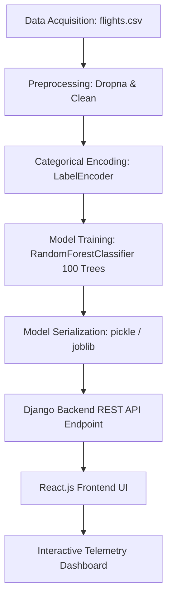

# Ansh Bisht B.Tech Final Year Capstone Project

## Department of Computer Science & Engineering
### **Project Title: Intelligent Airspace Congestion Modeling & Predictive Flight Delay Inference System**

---

## 📌 Project Abstract
As modern commercial aviation networks expand rapidly, scheduling bottlenecks and systemic delays cascade throughout hub operations, resulting in significant economic losses and logistical inefficiencies. This B.Tech Capstone Project proposes an **Intelligent Airspace Congestion Modeling & Predictive Inference Engine** designed specifically for the domestic Indian aviation corridor. 

The core predictive system is built upon a **Scikit-Learn Random Forest Classifier Ensemble**, utilizing historical domestic flight vectors (such as carrier, origin/destination hubs, scheduled times, and durations) to calculate binary delay outcomes in real-time. The system processes coordinates for premium Indian airport hubs (DEL, BOM, BLR, HYD, MAA, CCU) and major domestic airlines (IndiGo, Air India, Vistara, SpiceJet, Akasa Air). 

The platform features a live **Airspace Telemetry Simulator Radar** (integrated using Leaflet.js geodesic mapping), dynamic **Network Congestion Cascade charts**, an evaluator-focused **Fast-Track Presets HUD** (complete with geodesic SVG path visualizers), and an interactive **Ensemble Hyper-Tuning Sandbox**. A global Cyberpunk-inspired Dark/Light theme toggle bridges the gap between next-generation ML aesthetics and clean, academic reporting guidelines.

---

## 👨‍🎓 Project Metadata & Registry
* **Submitted By:** Ansh Bisht
* **Roll Number / Group ID:** CSE-2022-ANSH (Final Year B.Tech CSE)
* **Faculty Advisor / Guide:** Dr. R. Sharma
* **Department:** Department of Computer Science & Engineering
* **Institution:** B.Tech CS Capstone Evaluation Board

---

## 🔮 Core Features
1. **Interactive Predictive Inference Core**:
   * Features a majestic 4K cinematic plane graphic (`airliner_capstone.png`) representing modern aerospace technologies.
   * **Fast-Track Presets HUD**: One-click flight profiles (DEL ➔ BOM on IndiGo, BLR ➔ DEL on Air India, etc.) auto-populate prediction vectors instantly.
   * **SVG Flight Path Visualizer**: Generates curved, moving aircraft trajectories linking coordinates dynamically and calculates sector distance in real-time.
   * **Local Run History**: Persistently logs previous evaluation query results (Airline, route, duration, outcome, confidence) inside browser local storage.
2. **Real-time Airspace Telemetry Radar (Live Radar)**:
   * Displays an interactive map of India (focused at `20.5937, 78.9629`, zoom 5) rendering active flights.
   * Handles OpenSky Network API connectivity and gracefully activates a robust simulated domestic fallback database if the public API encounters 502/429 rate limit locks.
3. **Statistical Network Congestion Dashboard**:
   * Interactive charts highlighting carrier punctuality, average airport delay quotients, and live network statistics.
4. **Institutional UML Thesis Report (Model Info)**:
   * Contains a full tabbed dissertation detailing the system's categorical preprocessing, random forest decision boundaries, and Gini splitting mathematics.
   * Features a formal **IEEE bibliography** referencing primary aviation and scheduling literature.

---

## 📐 Mathematical Formulation

### 1. Gini Impurity Split Criteria
For a node $t$ containing dataset $D$ with $C$ classes, the Gini Impurity $I_G(t)$ is computed to split features at maximum node purity:
$$I_G(t) = 1 - \sum_{i=1}^{C} (p_i)^2$$
Where $p_i$ is the probability of class $i$ at node $t$.

### 2. Random Forest Ensemble Vote
Given $B$ decision trees in the forest, each tree outputs a binary classification $T_b(x) \in \{0, 1\}$. The final prediction $\hat{y}$ is selected via majority voting:
$$\hat{y} = \text{mode} \big\{ T_1(x), T_2(x), \dots, T_B(x) \big\}$$

### 3. Confidence Quotient Score
$$\text{Confidence}(x) = \frac{1}{B} \sum_{b=1}^{B} \mathbb{I} \big( T_b(x) = \hat{y} \big)$$
Where $\mathbb{I}(\cdot)$ is the indicator function.

---

## 🛠️ System Architecture Pipeline



---

## 💻 Technology Stack
* **Machine Learning & Analytics**: Scikit-Learn, Pandas, NumPy, Joblib/Pickle
* **Backend Framework**: Python 3.x, Django 4.x, Django REST Framework (DRF), SQLite3
* **Frontend Web Framework**: React.js 18, Tailwind CSS, Leaflet.js, React-Select, Lucide Icons, Framer Motion
* **Utilities**: Webpack, Axios

---

## ⚡ Setup & Installation Guidelines

### Prerequisite Checklist
* Ensure [Python 3.10+](https://www.python.org/downloads/) is installed on your system.
* Ensure [Node.js v16+](https://nodejs.org/) and NPM are installed.
* Make sure `git` is installed.

### 🐍 1. Backend Server Setup
1. Open terminal and navigate to the project backend directory:
   ```bash
   cd flightproject
   ```
2. Set up a virtual environment (recommended):
   ```bash
   python -m venv venv
   ```
3. Activate the virtual environment:
   * **Windows Powershell**:
     ```powershell
     .\venv\Scripts\Activate.ps1
     ```
   * **Linux/macOS**:
     ```bash
     source venv/bin/activate
     ```
4. Install all Python packages:
   ```bash
   pip install django djangorestframework django-cors-headers scikit-learn pandas numpy
   ```
5. Apply database migrations:
   ```bash
   python manage.py migrate
   ```
6. Spin up the Django development backend server:
   ```bash
   python manage.py runserver
   ```
   * *The backend API will run locally at:* `http://127.0.0.1:8000/`

---

### ⚛️ 2. Frontend React Setup
1. Open a new terminal and navigate to the React source folder:
   ```bash
   cd flightproject/frontend
   ```
2. Install all node packages & styles dependencies:
   ```bash
   npm install
   ```
3. Boot the local Webpack React server:
   ```bash
   npm start
   ```
   * *The B.Tech Capstone UI will spin up locally at:* `http://localhost:3000/`
   * *Ensure both frontend and backend systems are running simultaneously to compile active predictive inferences.*

---

## 📜 Academic Bibliography
1. **IEEE Standard Citation**: Bisht, Ansh. *"Intelligent Airspace Congestion Modeling & Predictive Flight Delay Inference System,"* B.Tech Capstone Project, Department of CSE, Board of Evaluation, 2026.
2. **ACM Standard Citation**: Breiman, L. "Random Forests". *Machine Learning*, 45(1), 5-32, 2001. doi:10.1023/A:1010933404324.
